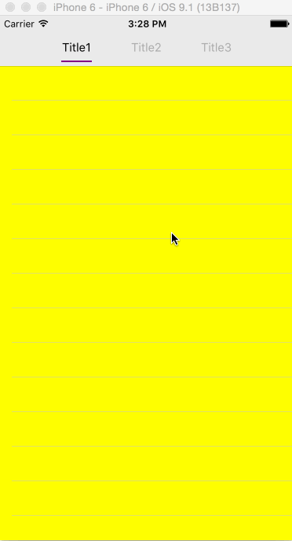

# LPViewPagerController

LPViewPagerController is a tiny controller component which is base on UIPageViewController and it's easy to use.

## Usage

```swift
// conform LPViewPagerDataSource
// implement method below
- (NSUInteger)numberOfTabsForViewPager:(LPViewPagerController *)viewPager;
// and there are 2 optional method for implement
- (UIViewController *)viewPager:(LPViewPagerController *)viewPager contentViewControllerForTabAtIndex:(NSUInteger)index;
- (UIView *)viewPager:(LPViewPagerController *)viewPager contentViewForTabAtIndex:(NSUInteger)index;

// conform LPViewPagerDelegate and implement these optional methods below if needed
- (void)viewPager:(LPViewPagerController *)viewPager didChangeTabToIndex:(NSUInteger)index;
- (CGFloat)viewPager:(LPViewPagerController *)viewPager valueForOption:(ViewPagerOption)option withDefault:(CGFloat)value;
- (void)setSubViewScrollStatus:(BOOL)enabled;

/** properties for customization */
//1.titleNormalColor for pagingTitleView
self.pagingTitleView.titleNormalColor = [UIColor greenColor];
//2.titleSelectedColor for pagingTitleView
self.pagingTitleView.titleSelectedColor = [UIColor yellowColor];
//3.indicatorColor for pagingTitleView
self.pagingTitleView.indicatorColor = [UIColor purpleColor];
//4.font for pagingTitleView
self.pagingTitleView.font = [UIFont systemFontOfSize:15.f];

```

## Install

using cocoaPods:  

```Object-C
  pod 'LPViewPagerController', '~> 1.0.0'
```

## Screenshot



## Update

-  v1.0.0 ---- first commit version
